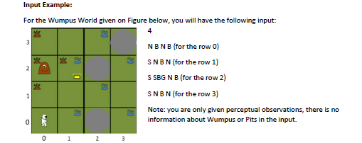
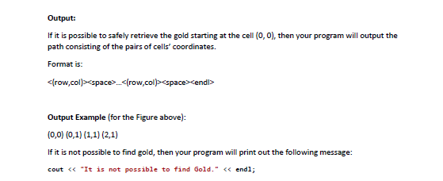
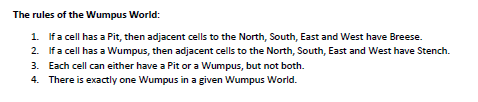

# Wumpus-World

Given a Wumpus world, out task is to find Gold, in such a way that we are not going to step on a Pit or a Wumpus cell.

## Input Example

## Output Example

## Rules for wumpus world

